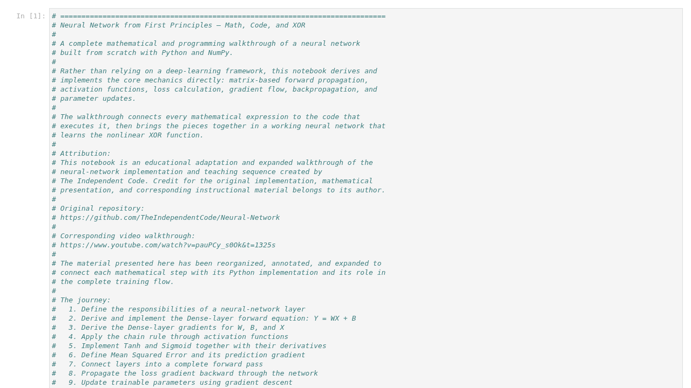

# Neural Network From Scratch



This project builds a fully connected neural network from first principles using
Python and NumPy. It connects the mathematics directly to the implementation:
forward propagation, activation functions, loss calculation, backpropagation,
gradient descent, and a complete XOR training flow.

## What's included

- [`complete_flow.ipynb`](complete_flow.ipynb) — a visual, mathematical, and
  programming walkthrough of the complete implementation and XOR example.
- [`layers/`](layers/) — the base, dense, and activation-layer implementations.
- [`activations.py`](activations.py) — activation functions and their
  derivatives.
- [`losses.py`](losses.py) — loss functions and their derivatives.
- [`training.py`](training.py) — forward prediction and backpropagation training
  utilities.
- [`usecases/`](usecases/) — executable examples and presentation-ready
  notebooks built on the same implementation.

## Run a use case

After cloning the repository, enter the use-case directory and run whichever
example you want. Dependencies such as NumPy, Matplotlib, and scikit-learn are
the user's responsibility.

```bash
cd deep-learning/nn-from-scratch/usecases

python xor.py
python circles.py
python two_moons.py
python iris.py
python sine_regression.py
python digits_0_vs_1.py
```
