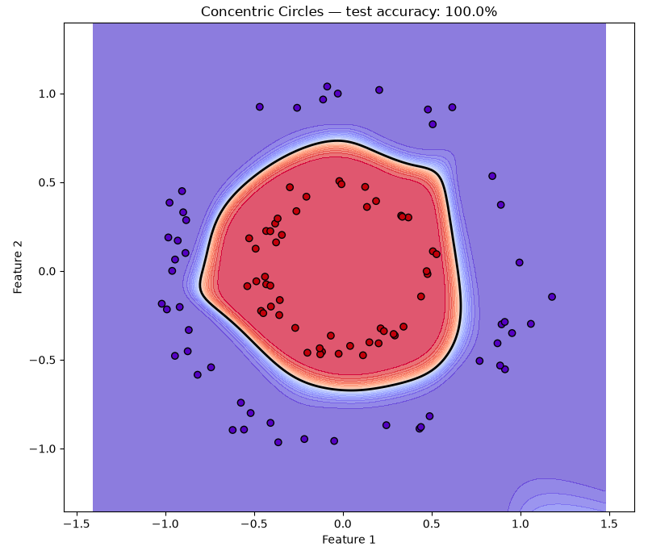

# Concentric Circles Classification

## Overview

This use case trains the neural network to separate an inner circle from an
outer ring. A linear classifier cannot solve the problem because one class
surrounds the other. The network must therefore learn a closed nonlinear
decision boundary.

## Dataset

The dataset is generated locally with `sklearn.datasets.make_circles`; no
manual download is required.

| Property | Value |
|---|---:|
| Samples | 400 |
| Input features | 2 |
| Classes | 2 |
| Gaussian noise | 0.06 |
| Inner/outer scale factor | 0.45 |
| Test split | 25% |
| Random seed | 42 |

## Data Preparation

1. Generate the concentric-circle samples.
2. Remove rows containing non-finite values.
3. Create a stratified train/test split.
4. Fit feature normalization on the training data only.
5. Apply the fitted transformation to the test data.
6. Reshape each sample into a `2 × 1` input column vector.

## Network Architecture

```text
Input(2)
  → Dense(2, 12)
  → Tanh
  → Dense(12, 12)
  → Tanh
  → Dense(12, 1)
  → Sigmoid
```

| Training setting | Value |
|---|---:|
| Loss | Mean Squared Error |
| Optimizer | Sample-by-sample gradient descent |
| Epochs | 800 |
| Learning rate | 0.05 |

## Verified Result

The saved CPU run achieved:

```text
Test accuracy: 100.00%
```

All 100 held-out test samples were classified correctly in this run.

## Learned Decision Boundary



The colored background is the network's predicted score across a dense grid of
possible inputs. Red indicates the region assigned to the inner-circle class;
purple indicates the outer-ring class. The thick black closed contour marks the
`0.5` classification threshold. A test point is classified correctly when its
marker color matches the surrounding background.

The visualization also shows why accuracy should be interpreted only on the
held-out points: colored regions far outside the observed circles are model
extrapolations, not evidence of performance on real samples.

## Run

From the repository's `usecases` directory:

```bash
python circles.py
```

Source: [`circles.py`](../../circles.py)

## What This Demonstrates

- A problem that cannot be separated by a straight line
- Representation learning with multiple hidden layers
- A closed nonlinear decision boundary
- Leakage-safe train/test preprocessing
- Visual evaluation of model behavior across the feature space

## Current Limitations

- The dataset is synthetic and low-dimensional.
- Training is sample-by-sample rather than vectorized by batch.
- MSE is used for binary classification.
- Performance is measured on one deterministic split.

## Possible Next Steps

- Compare the current network with a network that has no hidden layer.
- Increase the noise level and measure robustness.
- Add binary cross-entropy and compare convergence.
- Save decision-boundary snapshots from multiple epochs.
