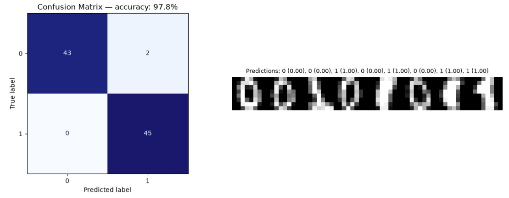

# Handwritten Digits: 0 vs 1

## Overview

This use case trains the neural network to distinguish handwritten zeros from
ones. It introduces image-like input and substantially increases the input
dimensionality while keeping the output task binary and computationally small.

## Dataset

The data is loaded with `sklearn.datasets.load_digits`. It is bundled with
scikit-learn, so no manual download is required. The original dataset contains
ten digit classes; this use case retains only digits `0` and `1`.

| Property | Value |
|---|---:|
| Image size | `8 × 8` pixels |
| Input features | 64 |
| Selected classes | 0 and 1 |
| Original pixel range | 0–16 |
| Normalized pixel range | 0–1 |
| Test split | 25% |
| Random seed | 42 |

## Data Preparation

1. Load the built-in Digits dataset.
2. Filter the samples to labels `0` and `1`.
3. Remove samples containing non-finite feature values.
4. Divide every pixel value by `16` to normalize it to `[0, 1]`.
5. Create a stratified train/test split.
6. Flatten each `8 × 8` image into 64 input values.
7. Reshape every input and target to the NN's column-vector format.

The original images are retained separately for the final prediction gallery.

## Network Architecture

```text
Input(64)
  → Dense(64, 32)
  → Tanh
  → Dense(32, 16)
  → Tanh
  → Dense(16, 1)
  → Sigmoid
```

| Training setting | Value |
|---|---:|
| Loss | Mean Squared Error |
| Optimizer | Sample-by-sample gradient descent |
| Epochs | 180 |
| Learning rate | 0.03 |

## Verified Result

The saved CPU run achieved:

```text
Test accuracy: 97.78%
```

The model correctly classified 88 of 90 held-out images. It recognized all 45
ones and misclassified 2 of the 45 zeros as ones.

## Confusion Matrix and Prediction Gallery



The confusion matrix on the left reports performance over the complete test
set: rows are true labels and columns are predicted labels. The gallery on the
right provides a qualitative check using individual `8 × 8` test images. Each
gallery label contains the predicted digit followed by the raw Sigmoid score in
parentheses; scores near `0` favor digit 0 and scores near `1` favor digit 1.

## Run

From the repository's `usecases` directory:

```bash
python digits_0_vs_1.py
```

Source: [`digits_0_vs_1.py`](../../digits_0_vs_1.py)

## What This Demonstrates

- Binary image classification
- Flattening two-dimensional images into feature vectors
- Pixel normalization
- A 64-dimensional input layer
- Generalization to unseen handwritten digits
- Evaluation with a confusion matrix and qualitative prediction gallery

## Current Limitations

- Only digits `0` and `1` are included.
- Spatial relationships between neighboring pixels are not modeled explicitly.
- The network uses MSE rather than binary cross-entropy.
- Training is sample-by-sample and does not use mini-batches.

## Possible Next Steps

- Extend the task to all ten digit classes.
- Add Softmax and categorical cross-entropy.
- Display only misclassified test images for error analysis.
- Compare the dense network with a small convolutional implementation.
