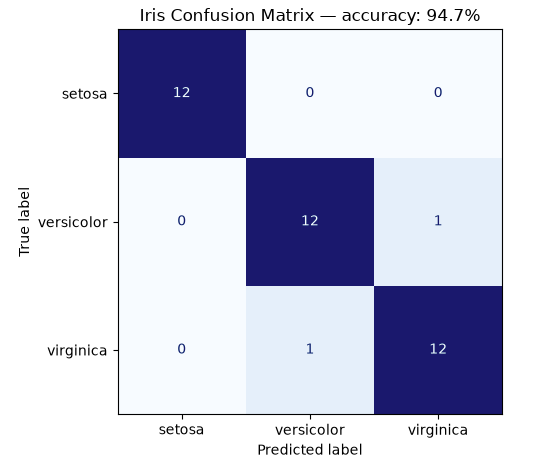

# Iris Multiclass Classification

## Overview

This use case applies the neural network to a real multiclass dataset. The
model predicts one of three Iris flower species from four measured features.
It extends the project from binary classification to multiple output classes.

## Dataset

The Iris dataset is loaded with `sklearn.datasets.load_iris`. It is bundled
with scikit-learn, so no manual download is required.

| Property | Value |
|---|---:|
| Samples | 150 |
| Input features | 4 |
| Classes | 3 |
| Samples per class | 50 |
| Test split | 25% |
| Random seed | 42 |

The four input features describe sepal length, sepal width, petal length, and
petal width.

## Data Preparation

1. Load the built-in Iris dataset.
2. Convert features to floating-point values and labels to integers.
3. Remove rows containing non-finite values.
4. Create a stratified train/test split.
5. Fit `StandardScaler` on training features only.
6. Convert class labels to three-element one-hot vectors.
7. Reshape samples and targets for the NN's column-vector convention.

## Network Architecture

```text
Input(4)
  → Dense(4, 8)
  → Tanh
  → Dense(8, 3)
  → Tanh
```

The three output values correspond to the three flower classes. The predicted
class is selected using `argmax`.

| Training setting | Value |
|---|---:|
| Loss | Mean Squared Error |
| Optimizer | Sample-by-sample gradient descent |
| Epochs | 900 |
| Learning rate | 0.03 |

This version deliberately uses Tanh and MSE so it remains compatible with the
current shared implementation. A later iteration can add Softmax and
categorical cross-entropy to the core NN.

## Verified Result

The saved portfolio run achieved:

```text
Test accuracy: 94.74%
```

The model correctly classified 36 of 38 held-out samples. Because Iris is small
and the Dense layers start from random weights, an independent run can produce
a slightly different result even with the same data split.

## Confusion Matrix



Rows represent the true species and columns represent the predicted species.
The model classified every Setosa sample correctly. It confused one Versicolor
sample with Virginica and one Virginica sample with Versicolor, which is the
only source of error in the saved run. The matrix makes the class-specific
behavior visible instead of reducing evaluation to a single accuracy value.

## Run

From the repository's `usecases` directory:

```bash
python iris.py
```

Source: [`iris.py`](../../iris.py)

## What This Demonstrates

- Multiclass classification
- One-hot target encoding
- Real tabular data
- Leakage-safe standardization
- Class selection with `argmax`
- Evaluation through a confusion matrix

## Current Limitations

- The output is not a normalized probability distribution.
- MSE is less appropriate for multiclass classification than cross-entropy.
- The small dataset makes results sensitive to the selected split.
- The current workflow does not include cross-validation.

## Possible Next Steps

- Add Softmax and categorical cross-entropy to the shared NN implementation.
- Report per-class precision, recall, and F1 score.
- Add repeated stratified cross-validation.
- Visualize the feature space with PCA while keeping the model trained on all
  four original features.
