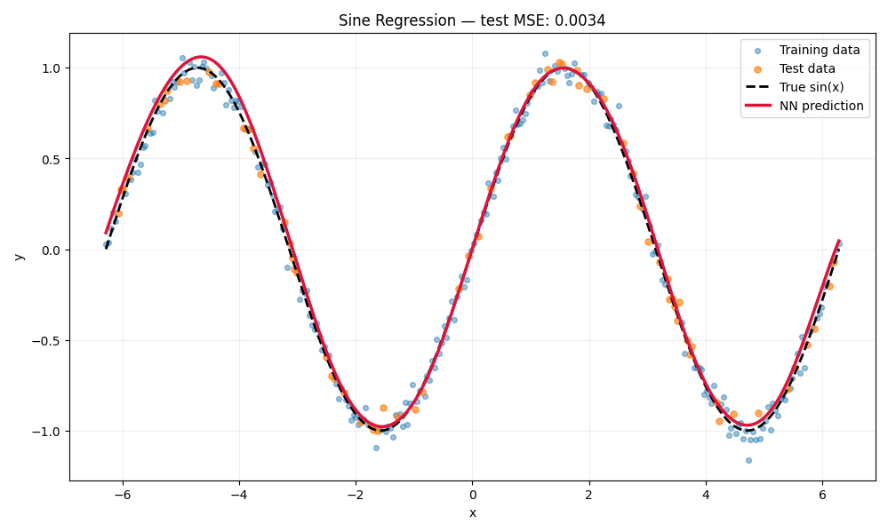

# Sine-Wave Regression

## Overview

This use case moves beyond classification and trains the neural network to
approximate a continuous nonlinear function. Given an input `x`, the model
predicts a noisy observation of `sin(x)`.

## Dataset

The dataset is generated locally with NumPy; no external download is required.

```text
y = sin(x) + Gaussian noise
```

| Property | Value |
|---|---:|
| Samples | 300 |
| Input features | 1 |
| Target values | Continuous |
| Input interval | `[-2π, 2π]` |
| Noise standard deviation | 0.05 |
| Test split | 25% |
| Random seed | 42 |

## Data Preparation

1. Generate evenly spaced input values.
2. Calculate `sin(x)` and add controlled Gaussian noise.
3. Remove any non-finite samples.
4. Split the data into training and test sets.
5. Fit `StandardScaler` on the training inputs only.
6. Reshape inputs and targets into the column-vector format used by the NN.

The target is not converted into a class label: this is a regression task, so
the network must produce a continuous numerical value.

## Network Architecture

```text
Input(1)
  → Dense(1, 16)
  → Tanh
  → Dense(16, 16)
  → Tanh
  → Dense(16, 1)
  → Linear output
```

The final Dense layer has no activation function, allowing the prediction to
take any real value.

| Training setting | Value |
|---|---:|
| Loss | Mean Squared Error |
| Optimizer | Sample-by-sample gradient descent |
| Epochs | 1,200 |
| Learning rate | 0.01 |

## Verified Result

The saved CPU run achieved:

```text
Test MSE: 0.0034
```

The low test error indicates that the predicted curve stays close to the
underlying sine function on unseen points from the same interval.

## Fitted Function



Blue markers are training samples and orange markers are held-out test samples.
The dashed black line is the exact `sin(x)` function; the solid red line is the
neural network's prediction. Their close alignment across two complete periods
shows that the network learned the nonlinear relationship rather than merely a
straight-line approximation. Small differences near extrema and interval edges
reflect observation noise and the finite training sample.

## Run

From the repository's `usecases` directory:

```bash
python sine_regression.py
```

Source: [`sine_regression.py`](../../sine_regression.py)

## What This Demonstrates

- Neural-network regression
- Approximation of a continuous nonlinear function
- A linear output layer
- Evaluation with Mean Squared Error
- Visual comparison of ground truth and prediction

## Current Limitations

- The training data covers only a fixed interval.
- The model is not expected to extrapolate reliably beyond that interval.
- Training is not mini-batched.
- Only one noise level and architecture are evaluated.

## Possible Next Steps

- Plot residuals on the test set.
- Compare multiple hidden-layer widths.
- Evaluate interpolation and extrapolation separately.
- Add train and test loss curves.
