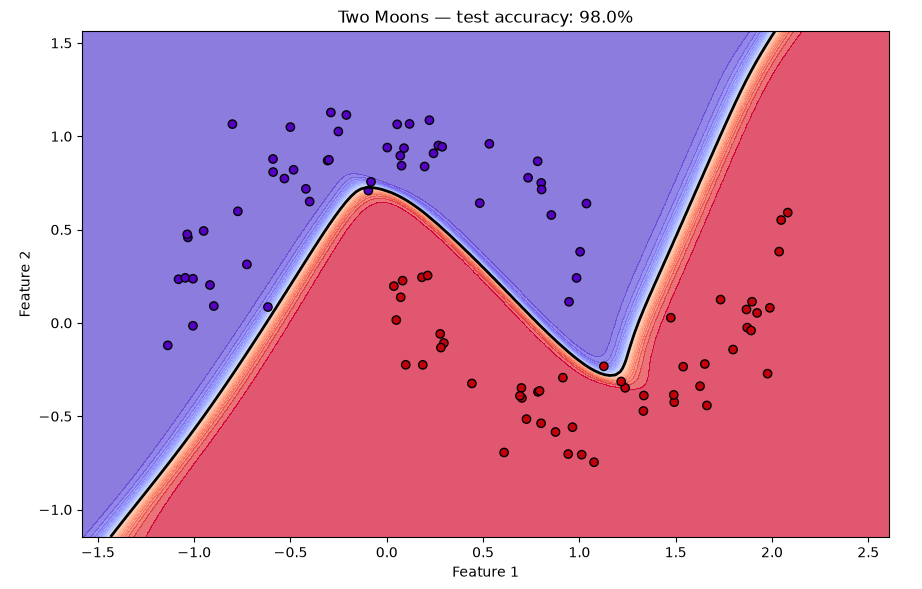

# Two Moons Classification

## Overview

This use case trains the neural network implemented from scratch to classify
two interleaving half-moon shapes. It is a natural step beyond XOR: the task is
still binary classification with two input features, but the network must learn
from hundreds of noisy samples and generalize to an unseen test set.

## Dataset

The dataset is generated locally with `sklearn.datasets.make_moons`; no manual
download is required.

| Property | Value |
|---|---:|
| Samples | 400 |
| Input features | 2 |
| Classes | 2 |
| Gaussian noise | 0.12 |
| Test split | 25% |
| Random seed | 42 |

## Data Preparation

1. Generate the two-moons dataset.
2. Remove rows containing `NaN` or infinite values.
3. Create a stratified train/test split so both sets preserve the class ratio.
4. Fit `StandardScaler` on the training set only.
5. Transform the test set with the training-set scaler.
6. Reshape every sample into the column-vector format expected by the network.

Fitting the scaler on training data only prevents information from the test set
from leaking into training.

## Network Architecture

```text
Input(2)
  → Dense(2, 8)
  → Tanh
  → Dense(8, 8)
  → Tanh
  → Dense(8, 1)
  → Sigmoid
```

| Training setting | Value |
|---|---:|
| Loss | Mean Squared Error |
| Optimizer | Sample-by-sample gradient descent |
| Epochs | 600 |
| Learning rate | 0.05 |

## Verified Result

The saved CPU run achieved:

```text
Test accuracy: 98.00%
```

The test set contains 100 samples, so this corresponds to 98 correct
classifications and 2 errors.

## Learned Decision Boundary



The colored background shows the network's predicted score over a dense grid.
Purple represents the region assigned to one moon and red represents the region
assigned to the other. The thick black `0.5` contour is the learned nonlinear
decision boundary. Most held-out points lie on a background matching their
marker color; the small number that do not account for the measured 2% error.

The smooth S-shaped separation is the key result: unlike a linear classifier,
the network follows the interleaving geometry of the two noisy classes.

## Run

From the repository's `usecases` directory:

```bash
python two_moons.py
```

Source: [`two_moons.py`](../../two_moons.py)

## What This Demonstrates

- Nonlinear binary classification
- Learning from noisy data
- Train/test separation
- Leakage-safe feature scaling
- Generalization to unseen samples
- Visual interpretation of a learned decision boundary

## Current Limitations

- Training processes one sample at a time rather than using mini-batches.
- The network uses MSE rather than binary cross-entropy.
- There is no validation set or early stopping.
- The implementation uses basic gradient descent without momentum or Adam.

## Possible Next Steps

- Add binary cross-entropy.
- Record and plot training and validation loss.
- Compare one and two hidden layers.
- Visualize the decision boundary at several training checkpoints.
