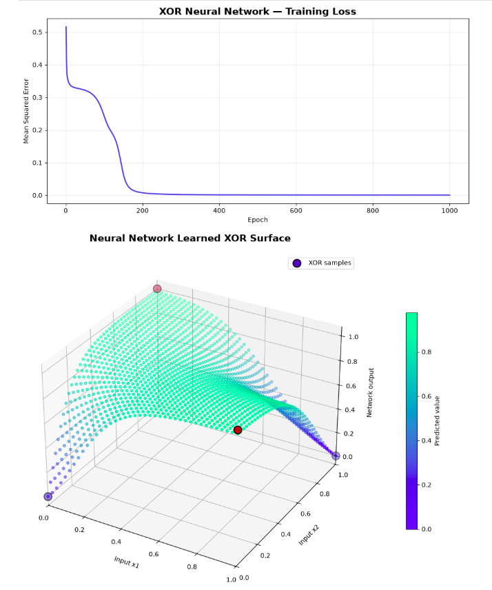

# XOR Classification

## Overview

This is the first end-to-end use case for the neural network implemented from
scratch. The model learns the XOR logical function using only NumPy-based Dense
layers, Tanh activations, explicit forward propagation, and manual
backpropagation.

XOR is a foundational neural-network example because its classes cannot be
separated by a single straight line. A hidden nonlinear layer is required.

## Dataset

The complete XOR truth table is created directly in code; no dataset download
is required.

| Input `x1` | Input `x2` | Target |
|---:|---:|---:|
| 0 | 0 | 0 |
| 0 | 1 | 1 |
| 1 | 0 | 1 |
| 1 | 1 | 0 |

| Property | Value |
|---|---:|
| Samples | 4 |
| Input features | 2 |
| Output values | 1 |
| Task | Nonlinear binary classification |

## Data Preparation

Each two-value input is reshaped into a column vector:

```text
[[x1],
 [x2]]
```

The resulting input tensor has shape `(4, 2, 1)`, while the target tensor has
shape `(4, 1, 1)`. The values are already finite and normalized, so no missing
value handling, feature scaling, or external preprocessing is necessary.

## Network Architecture

```text
Input(2)
  → Dense(2, 3)
  → Tanh
  → Dense(3, 1)
  → Tanh
```

| Notebook training setting | Value |
|---|---:|
| Loss | Mean Squared Error |
| Optimizer | Sample-by-sample gradient descent |
| Epochs | 1,000 |
| Learning rate | 0.1 |

The notebook is intentionally educational and self-contained: it presents the
layer abstractions, Dense mathematics, activation derivatives, MSE, forward
propagation, backpropagation, training, evaluation, and visualization in a
readable sequence. The shorter `xor.py` script uses the shared implementation
from the parent `nn-from-scratch` directory.

## Verified Result

The saved notebook run correctly classified all four XOR inputs:

```text
Accuracy: 4/4
Accuracy percentage: 100.00%
Final training loss: 0.0003143288
```

Because XOR contains only four possible binary inputs, this example evaluates
the learned mapping on the complete truth table rather than holding out a test
set.

## Training Loss and Learned Surface



The upper plot shows Mean Squared Error falling during training and approaching
zero. The lower three-dimensional plot evaluates the trained network across a
dense grid of possible `x1` and `x2` values:

- the horizontal axes represent the two inputs;
- the vertical axis represents the network output;
- values near `0` correspond to the negative XOR class;
- values near `1` correspond to the positive XOR class;
- the four highlighted samples are the XOR truth-table points.

The smooth surface demonstrates that the network has learned a nonlinear
function connecting the four discrete training examples.

## Run

Run the compact script from the repository's `usecases` directory:

```bash
python xor.py
```

Open the educational notebook with:

```bash
jupyter lab notebooks/xor/xor.ipynb
```

- Source script: [`xor.py`](../../xor.py)
- Notebook: [`xor.ipynb`](xor.ipynb)

## What This Demonstrates

- Why XOR cannot be solved by a single linear decision boundary
- Matrix-based forward propagation
- Manual gradient propagation through Dense layers
- The chain rule through nonlinear activations
- Parameter updates using gradient descent
- Quantitative evaluation across the complete XOR truth table
- Visualization of the learned nonlinear surface

## Current Limitations

- The dataset contains only four samples.
- There is no separate test or validation set.
- Training processes one sample at a time.
- The output uses Tanh with MSE rather than Sigmoid with binary cross-entropy.
- The example does not demonstrate robustness to noisy observations.

## Possible Next Steps

- Compare the nonlinear network with a model that has no hidden layer.
- Add a two-dimensional thresholded decision map.
- Compare Tanh + MSE with Sigmoid + binary cross-entropy.
- Visualize how the learned surface changes during training.
- Continue to the Two Moons and Concentric Circles use cases, which introduce
  noisy samples and test-set generalization.
